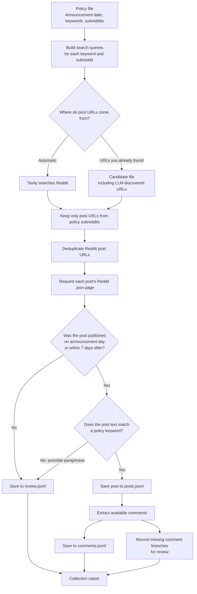

# Reddit policy-window collection workflow

Search produces candidate URLs. The post's Reddit timestamp and text determine whether it enters the matching dataset. Posts outside the date window or without an exact keyword match go to `review.jsonl` for inspection. The report records retrieval counts and incomplete comment threads.
