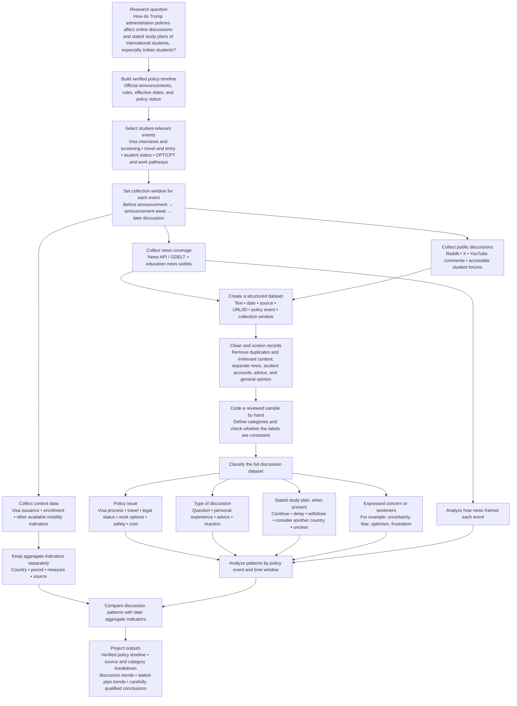

# Project workflow

This flowchart shows how the project connects Trump administration policy events, news coverage, online discussion, and international-student mobility indicators. The main period of interest is 2025–2026, with particular attention to Indian students.

**Classification rule:** A post expressing worry about a visa is coded as a concern, but it is not coded as a decision to delay or withdraw unless the writer explicitly states that plan. News coverage, student experiences, and general public comments remain identifiable as separate source types.
